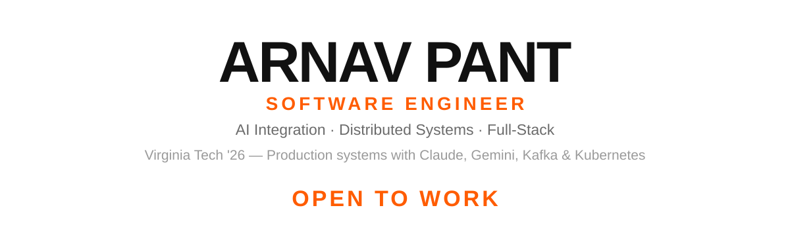

<picture>
  <source media="(prefers-color-scheme: dark)" srcset="assets/banner-dark.svg">
  
</picture>

**Distributed Systems Engineer** · **Production AI Integration** · Claude · Gemini · Kafka · Kubernetes

CS grad (Virginia Tech '26) focused on distributed systems and production AI integration. Recently shipped a production LLM-powered fintech app in 6 weeks (Plaid + Claude/Gemini), and built a fault-tolerant Kafka + Vertex AI architecture.

<table>
  <tr>
    <td align="center"><h2>40K+</h2>WEBCAT STUDENTS</td>
    <td align="center"><h2>46+</h2>REST APIs SHIPPED</td>
    <td align="center"><h2>&lt;50ms</h2>SERVICE DIAGNOSTIC LATENCY</td>
    <td align="center"><h2>150K+</h2>ANNUAL GRADING SUBMISSIONS</td>
  </tr>
</table>

---

### Stack

**Languages** &nbsp; `Java` `Python` `TypeScript` `JavaScript` `Kotlin` `SQL`

**AI / LLM** &nbsp; `Claude API` `Gemini API` `Vertex AI` `Agentic Systems` `MCP` `LLM Integration`

**Frameworks** &nbsp; `React` `Next.js` `React Native` `Django` `FastAPI`

**Infra & Data** &nbsp; `PostgreSQL` `Supabase` `Kubernetes` `Docker` `Apache Kafka` `Azure DevOps`

---

### Experience

| Role | Organization | When |
|---|---|---|
| Full-Stack Engineer | Finnimo | Nov 2025 – Present |
| LLM Undergraduate Researcher | Virginia Tech | May 2025 – May 2026 |
| Solutions Architect Intern | Al Ansari Group of Companies | Dec 2025 – Jan 2026 |
| Android SWE Intern | Altius Strategic Consulting | May – Aug 2024 |
| Power Apps Intern | Altius Strategic Consulting | May – Aug 2023 |

---

### Selected Work

**Finnimo** — Production LLM financial advisor with Plaid bank linking, live market data, and a Claude-powered chat interface for real-time portfolio analytics. Shipped end-to-end in 6 weeks. Visit at [finnimo.com](https://finnimo.com)

`TypeScript` `Claude API` `Gemini API` `Supabase` `Plaid`

 

**Ouroboros** — Self-healing, event-driven AI system built on Kafka with circuit-breaker fault tolerance and Vertex AI + Gemini 1.5 Pro middleware for agentic workflows. Streams real-time diagnostics via FastAPI at <50ms.

`Python` `Apache Kafka` `Vertex AI` `Gemini 1.5 Pro` `FastAPI`
→ [github.com/arnavpant/Ouroboros](https://github.com/arnavpant/Ouroboros)

 

**WebCat Capstone** — Kubernetes scheduler for 40,000+ students across 30+ universities, orchestrating 150,000+ annual job submissions with a custom HRRN scheduling algorithm and a fault-tolerant MariaDB job queue.

`Kubernetes` `Python` `Shell` `MariaDB`

---

### Currently

🔭 Building production AI integrations and distributed systems
📫 Reach out via the contact links above, or below

---

<picture>
  <source media="(prefers-color-scheme: dark)" srcset="assets/email-dark.svg">
  
</picture>
