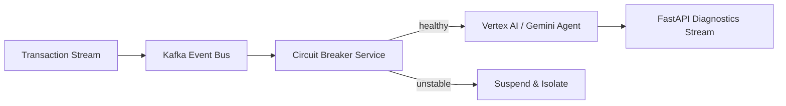

<picture>
  <source media="(prefers-color-scheme: dark)" srcset="assets/banner-dark.svg">
  
</picture>

[](https://github.com/arnavpant)

[](https://linkedin.com/in/arnavpant)
[](https://arnavpant.github.io/Personal-Portfolio/)

```ts
const arnav = {
  role: "Software Engineer",
  grad: "Virginia Tech '26",
  focus: ["distributed systems", "production AI integration"],
  recentShip: "LLM-powered fintech app — 6 weeks, Plaid + Claude/Gemini",
  status: "open_to_fullstack_or_backend_roles",
};
```

CS grad (Virginia Tech '26) focused on distributed systems and production AI integration. Recently shipped a production LLM-powered fintech app in 6 weeks (Plaid + Claude/Gemini), and built a fault-tolerant Kafka + Vertex AI architecture.


---

### Stack

**Languages** &nbsp; `Java` `Python` `TypeScript` `JavaScript` `Kotlin` `SQL`

**AI / LLM** &nbsp; `Claude API` `Gemini API` `Vertex AI` `Agentic Systems` `MCP` `LLM Integration`

**Frameworks** &nbsp; `React` `Next.js` `React Native` `Django` `FastAPI`

**Infra & Data** &nbsp; `PostgreSQL` `Supabase` `Kubernetes` `Docker` `Apache Kafka` `Azure DevOps`

---

### Experience

| Role | Organization | When |
|---|---|---|
| Full-Stack Engineer | Finnimo | Nov 2025 – Present |
| LLM Undergraduate Researcher | Virginia Tech | May 2025 – May 2026 |
| Solutions Architect Intern | Al Ansari Group of Companies | Dec 2025 – Jan 2026 |
| Android SWE Intern | Altius Strategic Consulting | May – Aug 2024 |
| Power Apps Intern | Altius Strategic Consulting | May – Aug 2023 |

---

### Finnimo — Production LLM Financial Advisor
**46+ authenticated REST APIs** · Plaid bank linking, live market data, Claude chat interface, real-time portfolio analytics

- Designed Supabase Postgres schema with Google OAuth + row-level security for per-user data isolation
- Engineered a Claude → Gemini fallback chain with async pipelines, unit tests, and Vercel CI/CD for high availability
- Shipped end-to-end in 6 weeks

`TypeScript` `Claude API` `Gemini API` `Supabase` `Plaid`

### Ouroboros — Self-Healing Event-Driven AI System
**<50ms** agent diagnostics · Kafka-based event-driven microservices with circuit-breaker fault tolerance

- Built a Python circuit breaker monitoring real-time transactions to suspend unstable processes under fault thresholds
- Integrated Vertex AI + Gemini 1.5 Pro through custom middleware for agentic workflows and runtime tool execution
- Streamed real-time diagnostics via FastAPI with optimized message serialization

`Python` `Apache Kafka` `Vertex AI` `Gemini 1.5 Pro` `FastAPI`
→ [github.com/arnavpant/Ouroboros](https://github.com/arnavpant/Ouroboros)

<details>
<summary>Architecture overview</summary>



</details>

### WebCat Capstone — Kubernetes Scheduler at Scale
**40,000+ students · 30+ universities · 150,000+ annual job submissions**

- Built a custom Highest Response Ratio Next (HRRN) scheduling algorithm for the Endeavour distributed cluster's job queue
- Refactored the execution engine to support 100+ concurrent containers, eliminating thread-pool bottlenecks
- Decoupled the job queue into a fault-tolerant MariaDB store ensuring 99.9% data durability under cluster failure

`Kubernetes` `Python` `Shell` `MariaDB`

---

### Currently

🔭 Building production AI integrations and distributed systems
📍 Open to full-stack / backend SWE roles — available June 2026
📫 Reach out via the contact links above, or below

---

<picture>
  <source media="(prefers-color-scheme: dark)" srcset="assets/email-dark.svg">
  
</picture>
